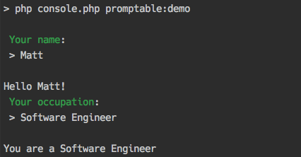
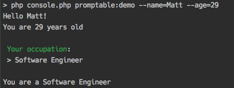
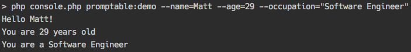
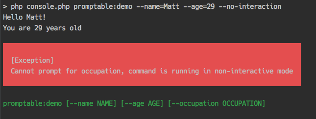

# Promptable Options for Symfony Console

[](https://travis-ci.org/vivait/symfony-console-promptable-options)

## Compatibility / Requirements

* PHP 5.5.9 and above
* symfony/console ^2.8|^3.0

## Installation

`composer require vivait/symfony-console-promptable-options`

## Usage

Configure the promptable options in the `configure()` method of your command.

You can call the `$this->addPrompt(string $optionName, array $configuration = [])` fluently with the other options to add a prompt for a single option.

Alternatively, call `$this->addPrompts(array $options = [])` fluently with the other options to add prompts for multiple options at the same time by providing a key value array of option names and their desired configurations. This does not over-write any previously added prompts, it adds them on to the options. Here's an example of adding multiple prompts:
```php
    protected function configure()
    {
        $this
            ->setName('promptable:test')
            ->addPrompts(
                [
                    'name', // No configuration provided - uses defaults
                    'age' => ['type' => 'int', 'required' => true]
                ]
            );
    }
```

Once configured, access options using  `$this->getConsoleOptionInput(string $optionName)`.

The table below shows how it acts in various situations:

|   | **Option marked as promptable** | **Option not promptable** |
|---|---|---|
| **Option supplied via** `--optionName=value` | The value of `--optionName=value` will be returned  | The value of `--optionName=value` will be returned |
| **Option not supplied via**  `--optionName=value` | The option will be asked for via an interactive question | `null` will be returned |

#### Non-interactive commands:

If you run a command that has promptable options **that are not supplied via** `--optionName=value` then an `\Exception` will be thrown with the message: `"Cannot prompt for optionName, command is running in non-interactive mode"`

#### Example command:

```php
<?php

use Symfony\Component\Console\Command\Command;
use Symfony\Component\Console\Input\InputInterface;
use Symfony\Component\Console\Input\InputOption;
use Symfony\Component\Console\Output\OutputInterface;
use Vivait\PromptableOptions\Command\PromptableOptionsTrait;

class PromptableCommand extends Command
{

    use PromptableOptionsTrait;

    protected function configure()
    {
        $this
            ->setName('promptable:demo')
            ->addPrompt(
                'name',
                ['description' => 'Your name', 'required' => true]
            ) // add a single thing to be prompted, which has a type or 'string' by default
            ->addPrompt('age', ['type' => 'int', 'description' => 'Your age', 'required' => true])
            ->addPrompt('occupation', ['type' => 'string', 'description' => 'Your occupation', 'required' => true])
            ->setDescription('To demonstrate the use of promptable input options');
        
        // alternatively:
        
        $this
            ->setName('promptable:demo')
            ->addPrompts(
                [
                    'name'       => ['description' => 'Your name', 'required' => true],
                    'age'        => ['type' => 'int', 'description' => 'Your age', 'required' => true],
                    'occupation' => ['description' => 'Your occupation', 'required' => true]
                ]
            ) // add multiple things to be prompted
            ->setDescription('To demonstrate the use of promptable input options');
    }

    /**
     * {@inheritdoc}
     */
    protected function execute(InputInterface $input, OutputInterface $output)
    {
        $this->setUpPrompt($input, $output);

        $name = $this->getConsoleOptionInput('name');
        $output->writeln(sprintf('Hello %s!', $name));

        $age = $this->getConsoleOptionInput('age');

        if ($age) {
            $output->writeln(sprintf('You are %s years old', $age));
        }
        
        $occupation = $this->getConsoleOptionInput('occupation');
        $output->writeln(sprintf('You are a %s!', $occupation));
    }
}
```

## Output

When no options are specified - promptable options are asked for, and non-promptable options are still optional:



When some options are specified - promptable options are asked for:



When all options are specified - nothing is prompted for input:



When some options are not specified and the command is run with `--no-interaction` - when an option not specified is asked for, the command errors:




## Option configuration

The following configuration options are available per option:

| Configuration value | Description | Allowed values |
|---------------------|-------------|----------------|
| type | The type of value to be expected (input will be transformed) | `int`, `integer`, `float`, `bool`, `boolean`, `string` (written as strings)|
| description | The description for the option/the text to be displayed when asking for the option | _anything_ |
| required | Whether or not the option is required. If it's set to true, then a value MUST be entered and they will be prompted until one is provided. If set to false, a default value will be used if set, or `null` will be returned as their input. | `true` or `false` (as boolean)
| default | The default value to use if one is not provided (if not required) | _anything_

## Contributing

This started as a project internally that we used on some of our projects, if there's new features / ideas you think could be useful please feel free to suggest them, or submit a PR!

Although this project is small, openness and inclusivity are taken seriously. To that end the following code of conduct has been adopted.

[Contributor Code of Conduct](CONTRIBUTING.md)
